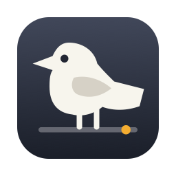
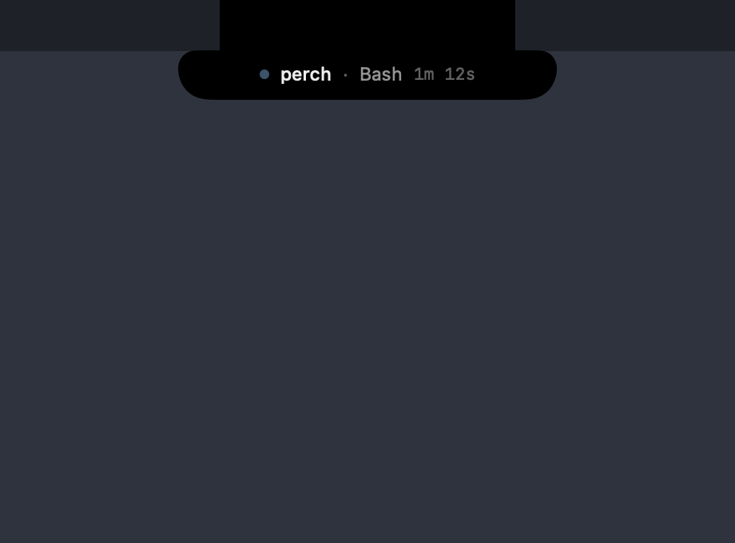
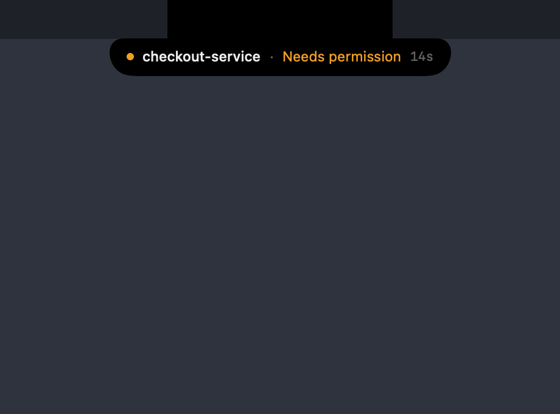
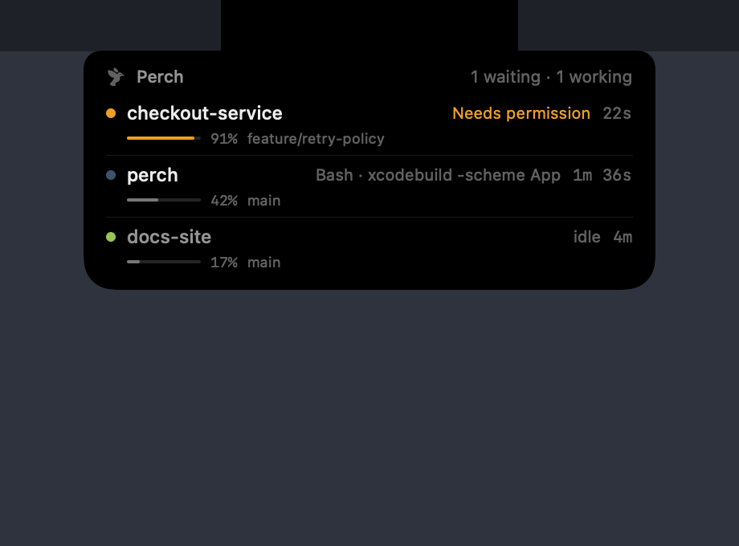
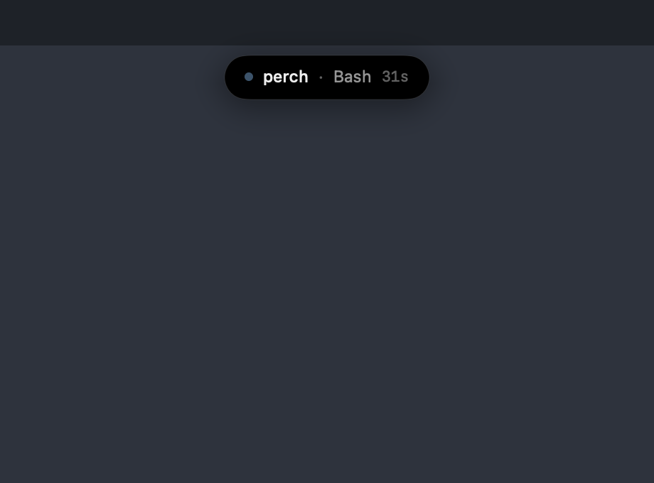

# Perch

A macOS menu bar app that shows what every Claude Code session on your machine is doing —
so when you hand Claude a long task and switch to something else, you can tell at a glance
whether it's still working, whether it finished, or whether it's been sitting blocked on a
permission prompt for ten minutes.

Optionally it also renders as a **notch island**: a black pill that hangs below the camera
cutout, showing the active session's tool and elapsed time, expanding to the full list on
hover. One island per display.

Notifications fire on the two transitions that matter: **a session needs input**, and
**a session finished**.




Hovering expands it to every session, with context usage and branch:



Displays without a notch get a detached pill just below the menu bar:



## Requirements

- macOS 14 or later
- Xcode 16 or later (Swift 6)
- Claude Code installed, in any form (CLI, desktop app, or IDE extension)

## Build and install

Open `Perch.xcodeproj` and run the **Perch** scheme, or from the terminal:

```bash
xcodebuild -project Perch.xcodeproj -scheme Perch -configuration Release build
```

Then copy the built `Perch.app` to `/Applications` and launch it. Open the popover, click
the gear, and press **Install** to register the hooks. Or from the terminal:

```bash
/Applications/Perch.app/Contents/MacOS/perch-hook --install
```

Hooks take effect immediately — running sessions pick them up without restarting.

### Targets

| Target | What it is |
|---|---|
| `Perch` | The menu bar app. Owns Info.plist, entitlements, signing, icon, version |
| `perch-hook` | The hook helper, embedded into `Perch.app/Contents/MacOS` |
| `PerchCore` | Static library with all the logic — the only target under test |
| `PerchCoreTests` | 50 tests, run by the shared `Perch` scheme |

### Signing

The project ad-hoc signs by default (`CODE_SIGN_IDENTITY = "-"`), so a fresh clone builds
with no Apple account and no configuration. That is enough to run it on the machine that
built it, including notifications and launch-at-login.

To distribute a build other people can open, you need a **Developer ID Application**
certificate — an *Apple Development* certificate will not do, as it cannot be notarised.
Then:

```bash
TEAM_ID=XXXXXXXXXX ./Scripts/release.sh
```

That archives, signs with hardened runtime, notarises, staples and verifies. It checks
every prerequisite up front and tells you exactly what is missing.

## How it works

Three sources, each authoritative for one thing:

| Question | Source |
|---|---|
| Which sessions exist? | `~/.claude/sessions/<pid>.json`, Claude Code's live-process registry |
| What is each one doing? | Claude Code hooks → `perch-hook` → an NDJSON spool the app tails |
| How full is the context? | The session's `.jsonl` transcript |

The split matters. The registry is the authority on *existence*: if the app was closed, or
crashed, or hooks were never installed, the session list is still correct — those sessions
just show as "no activity seen yet". And a session whose process is gone disappears even if
its `SessionEnd` hook never fired.

Hooks are the authority on *behavior*, because **nothing on disk records whether a session
is working or blocked**. A permission prompt writes nothing to the transcript, so a session
waiting on you is byte-for-byte indistinguishable from one busy running tests. Hooks are the
only mechanism that can tell them apart, which is why the app asks to install them.

The spool is a file rather than a socket because hooks fire whether or not Perch is running.
On launch the app replays it to rebuild state, silently — no burst of notifications for turns
that ended hours ago.

`CLAUDE_CONFIG_DIR` is honoured if you've set it.

### The notch island

The cutout is a *physical hole* — no pixels exist behind it — so nothing can draw "in" the
notch. What works is a pure-black body drawn flush against its bottom edge: down the centre
the two become one continuous shape.

An earlier version cut concave shoulders into the top corners so the body appeared to bulge
out of the cutout. Measuring the rendered pixels killed it — a concave shoulder has to dip
below the menu bar's bottom edge, and everything below that line is desktop wallpaper, so
the curve revealed a 9pt stripe of wallpaper and read as a rendering gap. The top edge is
flush now.

The window is click-through (`ignoresMouseEvents`), so the island never intercepts anything;
hover is detected by polling the pointer, and all interaction stays in the menu bar popover.
Displays without a notch get a detached floating pill instead.

## The hooks it installs

Seven entries in `settings.json`, all `async` so they never add latency to a session:
`SessionStart`, `SessionEnd`, `UserPromptSubmit`, `PreToolUse`, `PostToolUse`,
`Notification`, `Stop`.

Your existing settings and your own hooks are preserved — Perch's entries are tagged by the
`perch-hook` path and removed exactly on uninstall, which is covered by a round-trip test. A
one-time backup is written to `settings.json.perch-backup` before the first edit.

```bash
/Applications/Perch.app/Contents/MacOS/perch-hook --uninstall
```

## Stability caveat

**Perch reads Claude Code's internal files, which are not a public API.** The session
registry, the transcript schema, and the hook payload shape can all change between Claude
Code releases. Hooks themselves are documented and stable; the other two are not.

The code is built to fail soft rather than break: hook payloads decode into a permissive
JSON tree so new fields never throw, transcript parsing returns `nil` rather than
propagating errors, and the registry stays authoritative for the session list even when
everything else goes quiet. But a schema change can still leave Perch showing less than it
should. If sessions stop appearing after a Claude Code update, run `perch-hook --doctor`
first — it prints exactly what each layer can see.

## Troubleshooting

```bash
/Applications/Perch.app/Contents/MacOS/perch-hook --doctor
```

Prints the live registry, hook install status, spool contents, and the state the app derives
from them — using the same code the app does, so the two can't disagree.

For a live trace, run the app from a terminal:

```bash
PERCH_DEBUG=1 /Applications/Perch.app/Contents/MacOS/Perch
```

## Notes on the data

Three things that are not obvious, and cost real debugging time:

- **`procStart` in the registry is not comparable to your `ps` output.** It's `ps -o lstart=`
  as captured by the Claude Code process, rendered in *that* process's timezone — observed
  as UTC for desktop-launched sessions while a local `ps` renders local time. String-comparing
  them marks every session dead. Perch asks the kernel for the process start time via
  `sysctl` and compares against the record's `startedAt` epoch instead.

- **The context window size is not recorded anywhere.** A verified 1M-context session logs
  `"model": "claude-opus-5"`, identical to a 200k one, with no `betas` or window field. Perch
  infers it from usage: a session holding more than 200k tokens is not on the 200k model.
  This under-reports a long-context session until it crosses 200k.

- **Cached tokens are real context.** A turn resuming from cache reports `input_tokens` of
  ~2 and puts everything else under the cache keys, so summing only `input_tokens` shows an
  empty context window on a nearly-full session.

Also worth knowing: `~/.claude/telemetry/` looks like the obvious place to get token and cost
numbers, but it's a *failed-upload retry spool* — arbitrary coverage, and no token or cost
data at all. Perch reads transcripts instead.

## Not included

- **Cost in USD.** Only a `statusLine` command receives `total_cost_usd`, and installing one
  would hijack the status line you see in the terminal.
- Anything that syncs across machines.

## Development

```bash
xcodebuild -project Perch.xcodeproj -scheme Perch test
```

`PerchCore` holds the logic and is covered by tests; `Perch` is SwiftUI and AppKit only,
and `perch-hook` is a thin shell over `PerchCore`.

`Perch.xcodeproj` is committed and Xcode is the source of truth for it. `Scripts/generate-project.py`
regenerates it from scratch if a bad merge ever corrupts the pbxproj — but do not run it to
pick up new source files; add those in Xcode, or the generator will discard settings changed
through the UI.

The island can't be screenshotted without screen-recording permission, so its states render
off-screen instead — against a simulated notch and menu bar, at every state:

```bash
PERCH_SNAPSHOT=/tmp/shots ./build/Perch.app/Contents/MacOS/Perch && open /tmp/shots
```

That's how the wallpaper-gap bug above was found. Use it when changing the island.

## Contributing

Issues and pull requests welcome. Two things to keep in mind:

- Anything that writes to `settings.json` needs a test proving the round-trip leaves the
  user's file exactly as it was found.
- Anything that changes the island needs a before/after from `PERCH_SNAPSHOT`.

## Licence

MIT — see [LICENSE](LICENSE).
