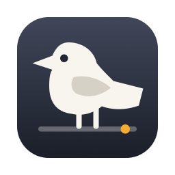

# Perch

See what every Claude Code session on your Mac is doing — working, waiting on you, or
done — from the menu bar or the notch.


- **Menu bar** — a bird with a count of working sessions; turns orange when one needs you.
- **Notch island** — a pill under the camera that expands to every session on hover.
- **Notifications** — when a session needs input, and when it finishes.

## Install

Needs macOS 14+ and Xcode 16+.

```bash
xcodebuild -project Perch.xcodeproj -scheme Perch -configuration Release build
```

Copy `Perch.app` to `/Applications` and open it. Then click the gear icon › **Install** to
register the Claude Code hooks. Running sessions pick them up without a restart.

## Troubleshooting

```bash
/Applications/Perch.app/Contents/MacOS/perch-hook --doctor
```

Prints sessions, hook status and derived state. Run the app with `PERCH_DEBUG=1` for a live
trace. `perch-hook --uninstall` removes the hooks.

## How it works

Perch finds sessions in `~/.claude/sessions/`, learns what each is doing from Claude Code
hooks, and reads context usage from the session transcript. The hooks are added to your
`settings.json` without touching your own entries.

> Perch reads Claude Code's internal files, which aren't a public API. A future Claude Code
> update can leave it showing less than it should.

## Development

```bash
xcodebuild -project Perch.xcodeproj -scheme Perch test
```

Logic lives in `PerchCore`, the app in `Perch`, and the hook helper in `perch-hook`. Run
`Scripts/generate-project.py` after adding or removing files. Design notes are in
[learning.md](learning.md).

## Licence

MIT — see [LICENSE](LICENSE).
